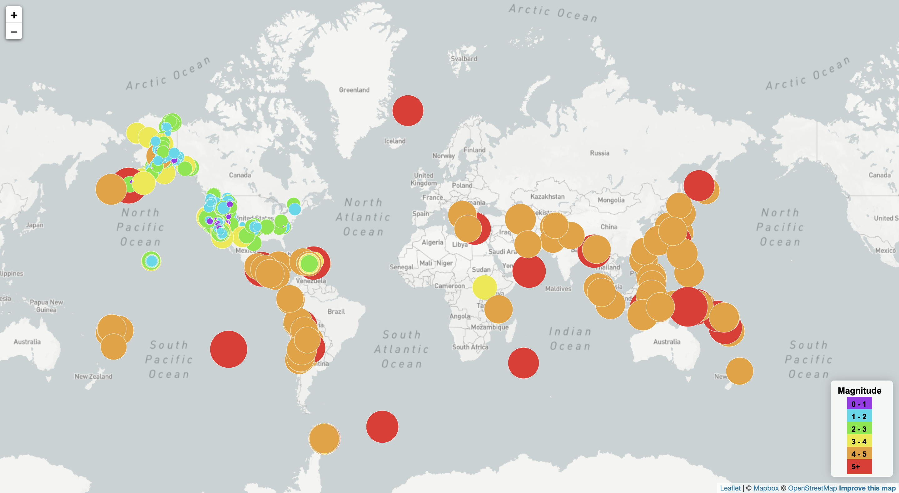

# Leaflet-Challenge
## Data:
 The USGS provides earthquake data in a number of different formats, updated every 5 minutes. Visit the [USGS GeoJSON Feed](http://earthquake.usgs.gov/earthquakes/feed/v1.0/geojson.php) page and pick a data set to visualize. When you click on a data set, for example 'All Earthquakes from the Past 7 Days', you will be given a JSON representation of that data. You will be using the URL of this JSON to pull in the data for our visualization.
 faultline date:(https://github.com/fraxen/tectonicplates)

## Summary:
In this challenge, I used the the API for mapbox to help create a map to display the data. We also used leaflet to add tilelayers, markers, and legends to the map.

The markers allowed me to pinpoint where each earthquake has happened. I used a circle marker so the color of the marker would change based on the magnitude of the earthquake. I created a legend so that users could easily tell the magnitudes of the earthquakes by the color. The size of the circle marker also increased with the magnitude. 

Using the fault line data, I was able to create lines on the map that show where the fault lines are. This allowed users to see where earthquakes happen in reference to fault lines. On this map, I created different tilelayers so that the user could choose what map view they would like to see. The user could also click the data based on what they wanted to see. So they could see no, data, earthquake data, faultline data, or both. 

## Visualizations
### Part 1

## Part 2
1[part2](step2.png)
